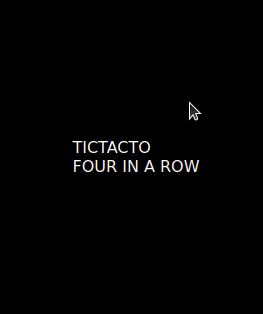
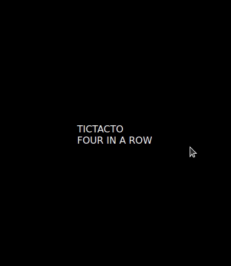
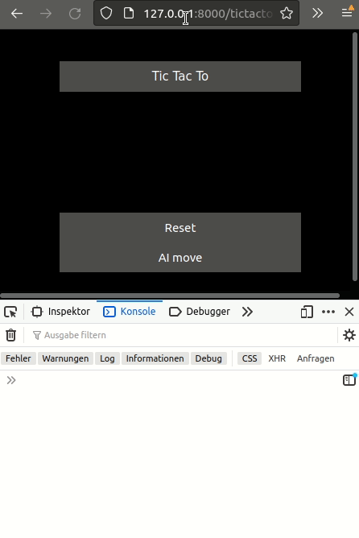

# Board Games in WASM with web-worker

For self-educational purposes and for fun, I implemented the games TicTacToe and Four-in-a-row. Both frontend and backend are written in Rust and compiled to WebAssembly.





## Build & Run
To build the project, you need to install [Rust] with [cargo] and [wasm-pack]. After cloning the repository, you can build the project with the provided script:
```bash
./build.sh
```

The easiest way to run it is to launch a basic web server serving the `www` subdirectory, e.g. in python:
```bash
cd www
python3 -m http.server --bind 127.0.0.1
```

## Game Engine
Both games share the same backend _engine_: We build a tree of possible moves up to a certain depth. Now the player can either do a move, which will be tracked in the evaluator or we can request the next best move from the evaluator. The best move is calculated in a traditional manner by summing over the average position value of each move.

## Key Features
- The board is visualized as [HTML canvas][html_canvas] which is drawn with wasm code.
- Frontend interaction and callback functions are written in Rust with [web-sys][web-sys].
- To separate the frontend from the backend, the evaluator doing the heavy lifting is running in a separate web-worker process. This web-worker is spawned from within WebAssembly.
- The game interface automatically evaluates if one of the players has won.
- Output on the JS console informs about what is going on in the backend.

## Technologies / Frameworks
- [wasm-pack][wasm-pack] to compile Rust to WebAssembly
- [wasm-bindgen][wasm-bindgen] for interaction between Wasm modules and JavaScript
- [web-sys][web-sys] to make Web APIs available in Rust

## Rust Features
One of the motivations for developing this project was to apply what I learned in the [Rust book][rust_book] to a real-life project. Below are some of the features that I like about Rust and which I used in this project. Some of these features are of course not only found in Rust.
- [Interior mutability pattern][int_mut] used for the tree of game states
- [`match` patterns][match] for exhaustive control flow
- [`if let`][if_let] for concise control flow
- [`Result<>`][result] for error handling
- [`Option<>`][option] to allow not returning a result
- [Generic function implementations][generics] in the `GameEvaluator`
- `GameState` [trait][traits], implemented by the `TTTGameState` and `FiarGameState` to define shared behavior
- [Enums with different data type variants][enum_variants] used for the `Message` passed between the main thread and the worker
- Custom [iterators][iter] for traversing the tree, one of them depth-limited
- [Closures][closures] in finding the best next move and for plenty of callbacks in the front-end
- [Declarative macros (`macro_rules!`)][decl_macros] to avoid code duplication in the implementation of the two variants of the `WorkerInterface` (`wasm-bindgen` does not support generics)

## Possible next steps
If I get around to it, here are possible next steps that I want to look at:
- Using integers instead of floats in the `GameState` structs for higher performance
- Being able to interrupt a running worker and evaluate only what was calculated so far (a part of this is implemented already)
- Spawning a whole pool of workers for faster calculation
- Abstracting the concept/engine to chess (my initial goal)

Please excuse that there are very few tests and the documentation is lacking a lot - since I am working on this repository for fun, this was not my main focus.

~ Simon B. Gasse

[html_canvas]: https://www.w3schools.com/html/html5_canvas.asp
[wasm-pack]: https://github.com/rustwasm/wasm-pack
[wasm-bindgen]: https://github.com/rustwasm/wasm-bindgen
[web-sys]: https://rustwasm.github.io/wasm-bindgen/web-sys/index.html
[rust_book]: https://doc.rust-lang.org/book/
[int_mut]: https://doc.rust-lang.org/book/ch15-05-interior-mutability.html
[match]: https://doc.rust-lang.org/book/ch06-02-match.html
[if_let]: https://doc.rust-lang.org/book/ch06-03-if-let.html
[result]: https://doc.rust-lang.org/book/ch09-02-recoverable-errors-with-result.html
[enum_variants]: https://doc.rust-lang.org/book/ch06-01-defining-an-enum.html
[iter]: https://doc.rust-lang.org/book/ch13-02-iterators.html
[closures]: https://doc.rust-lang.org/book/ch13-01-closures.html
[decl_macros]: https://doc.rust-lang.org/book/ch19-06-macros.html#declarative-macros-with-macro_rules-for-general-metaprogramming
[generics]: https://doc.rust-lang.org/rust-by-example/generics.html
[traits]: https://doc.rust-lang.org/book/ch10-02-traits.html

