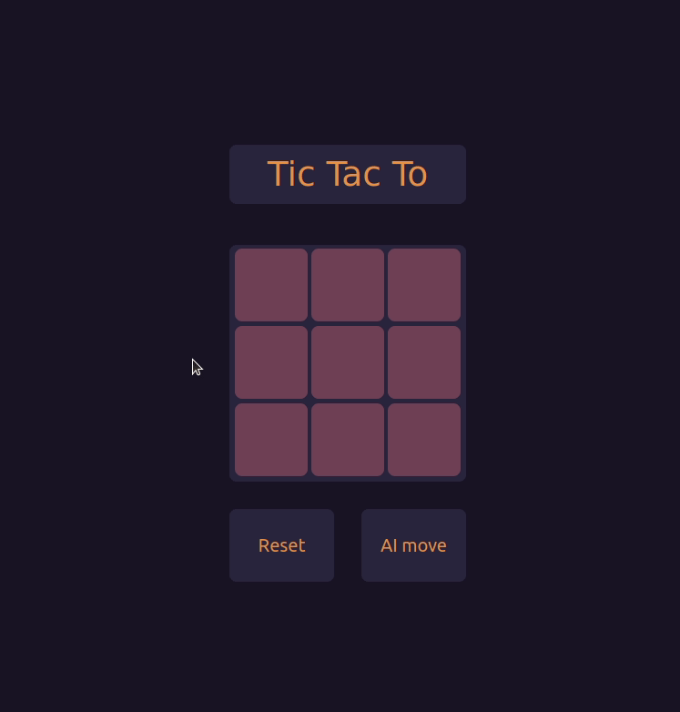
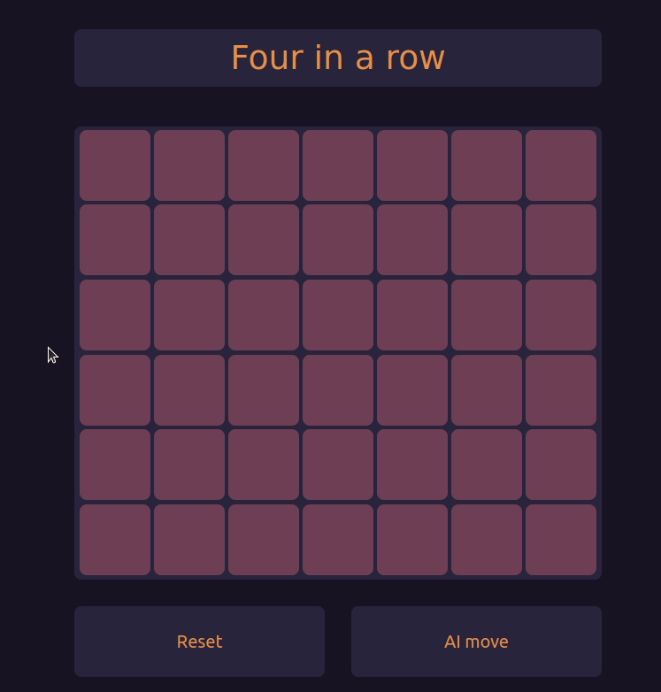

# Board Games in Wasm with web-worker

For self-educational purposes and for fun, I implemented the games TicTacToe and
Four-in-a-row. In the initial version, both frontend and backend
were implemented in Rust compiled to WebAssembly. In the latest refactor, I only
implemented the backend in Rust and the frontend interaction in JS since Wasm
frontend code is very tedious and somewhat ugly to write.




## Build & Run

To build the project, you need to install [Rust with cargo][install_rust] and
[wasm-pack]. After cloning the repository, you can build the project with the
provided script:

```bash
./build.sh
```

The easiest way to run it is to launch a basic web server serving the `www`
subdirectory, e.g. in python:

```bash
cd www
python3 -m http.server --bind 127.0.0.1
```

## Game Engine

Both games share the same backend _engine_: We build a tree of possible moves
down to a certain depth. Now the player can either do a move, which will be
tracked in the evaluator or we can request the next best move from the
evaluator. The best move is calculated in a traditional manner using the
[minimax algorithm][minimax].

## Key Features

- The board is visualized as `flexbox` array of HTML `<div>` elements. While the
  initial version used an [HTML canvas][html_canvas] drawn with Wasm, using HTML
  elements has the advantage that we can use all the rendering-power built-in to
  browsers for colors, transitions, mouse-over animations etc.
- Frontend interaction and callback functions are written in JS code. The intial
  version had them written in ugly verbose Rust code using [web-sys][web-sys].
- To separate the frontend from the backend, the evaluator doing the heavy
  lifting is running in a separate web-worker process. For more examples of
  spawning and interacting with web workers from Wasm, be sure to also check out
  [Wasm Worker Interaction][wasm-worker].
- The game interface automatically evaluates if one of the players has won.
- Output on the JS console informs about what is going on in the backend.

## Technologies / Frameworks

- [wasm-pack][wasm-pack] to compile Rust to WebAssembly
- [wasm-bindgen][wasm-bindgen] for interaction between Wasm modules and JavaScript
- [web-sys][web-sys] to make Web APIs available in Rust

## Idiosyncracies / particularities in Wasm + Rust

One of the motivations for developing this project was to apply what I learned
in the [Rust book][rust_book] to a real-life project. It helped me to
apply many learnings (danger of reference cycles in the
[interior mutability pattern][int_mut], [`match` patterns][match] for exhaustive
control flow, [`if let`][if_let] for concise control flow,
[`Result<>`][result] for error handling, [traits][traits] for shared
behavior, custom [iterators][iter] for traversing the tree etc.)
However in some places, Wasm limits the freedom of the developer a little and
below are a few examples and how I approached them.

- Due to its semantic concepts and internal representation, `Vec<T>` cannot be
  the return type of a function which has Wasm bind generation activated. The
  best way to work around this (according to the [Wasm book][wasm_book_render])
  is to expose a function with a raw pointer (`*const T`) and initialize a
  matching array on the JS side (in my case `UInt8Array`). This way, JS and Wasm
  access the same memory and do not have to copy data between each other.
- Another common return type not available to code with bind generation is
  `Result<T, E>` - the only variant possible is `Result<T, JsValue>`.
- Speaking on bind code generation, this is done by adding the `#[wasm_bindgen]`
  procedural macro to `struct` and `impl` blocks. In some cases, we want a few
  functions that are never called from JS to return types which cannot be used
  in JS. To achieve this, we can separate our functions into those for shared
  usage with JS and those that are only called from within Wasm. Thus one `impl`
  block gets the procedural macro and the other does not.
- Non-trivial data structures imported from Wasm **have** to be initialized in
  Wasm memory using constructor functions. So `MyWasmStruct.new(...)` works and
  subfields can then be accessed by JS code. However `new MyWasmStruct(...)`
  will create an objects that raises null-pointer exceptions when inspecting its
  fields.
- At the moment, there is no support for generics under `#[wasm_bindgen]`. In
  my case, a natural candidate for generics would have been the `GameInterface`.
  To avoid code duplication nonetheless, I created a
  [declarative macro (`macro_rules!`)][decl_macros] to use the same slightly
  customized `impl` block for the `GameInterface` types specific to Tic-Tac-To
  and Four-in-a-row.

## Change history

This is a very rough overview of what changed in the project and some ideas
on what I might do next.

- In the initial version, the frontend was written in Rust compiled to Wasm. In
  the refactored version, I moved the frontend interaction code to JS because it
  yields itself more naturally to it.
- The initial version used a `Node` type with the
  [interior mutability pattern][int_mut] for the tree structure. On the first
  intent, I implemented it poorly creating reference cycles. While I could have
  just removed the reference cycles, I went for an index-based tree structure
  instead. Some rough benchmarks indicated that at least on my hardware, it is
  more performant (possible because children are next to each other in arrays
  and thus cache misses are less common).
- In the initial version, I already implemented part of the logic but did not
  finalize the concept of _stopping_ the expansion whenever the user interaction
  needs the tree to be evaluated. In this version, I expand the tree level by
  level. Each expansion schedules the expansion for the next level (until the
  maximum depth) with a delay of 1ms. This way, messages which have arrived
  during the last expansion from the main thread are processed before in the
  `async` loop, making it possible to evaluate the tree before the expansion is
  completed to maximum depth.
- The `GameState` was bloated in the initial version and carried both absolutely
  necessary information as well as helper variables for the iteration etc. In
  the refactored version, I removed many fields that I could work around (e.g.
  deriving if a state is final by comparing the value to a fixed win value,
  using the same field for the averaged value as well as the fixed win value for
  final states etc.). By separating the values from the stored boards, the
  data representation should also be more cache-friendly, as the most expensive
  paths (expanding the tree and averaging the values) both iterate over separate
  arrays with minimal information.
- Not needing the precision of `f32`, I refactored the `GameState` to use `i32`
  instead.

## Possible next steps

If I get around to it, here are possible next steps that I want to look at:

- Spawning a whole pool of workers for faster calculation
- Abstracting the concept/engine to chess (my initial goal)

This being a self-educational side project, I did not add tests and
documentation everywhere but only where I need it myself.

~ Simon B. Gasse

[decl_macros]: https://doc.rust-lang.org/book/ch19-06-macros.html#declarative-macros-with-macro_rules-for-general-metaprogramming
[enum_variants]: https://doc.rust-lang.org/book/ch06-01-defining-an-enum.html
[generics]: https://doc.rust-lang.org/rust-by-example/generics.html
[html_canvas]: https://www.w3schools.com/html/html5_canvas.asp
[if_let]: https://doc.rust-lang.org/book/ch06-03-if-let.html
[install_rust]: https://www.rust-lang.org/tools/install
[int_mut]: https://doc.rust-lang.org/book/ch15-05-interior-mutability.html
[iter]: https://doc.rust-lang.org/book/ch13-02-iterators.html
[match]: https://doc.rust-lang.org/book/ch06-02-match.html
[minimax]: https://en.wikipedia.org/wiki/Minimax
[result]: https://doc.rust-lang.org/book/ch09-02-recoverable-errors-with-result.html
[rust_book]: https://doc.rust-lang.org/book/
[traits]: https://doc.rust-lang.org/book/ch10-02-traits.html
[wasm_book_render]: https://rustwasm.github.io/docs/book/game-of-life/implementing.html#rendering-to-canvas-directly-from-memory
[wasm-bindgen]: https://github.com/rustwasm/wasm-bindgen
[wasm-pack]: https://github.com/rustwasm/wasm-pack
[wasm-worker]: https://github.com/sgasse/wasm_worker_interaction
[web-sys]: https://rustwasm.github.io/wasm-bindgen/web-sys/index.html
